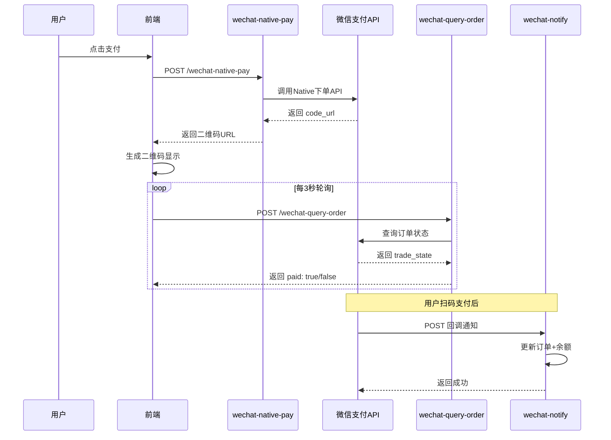

# PC 微信扫码支付 - 技术文档

> ⚠️ 此文档仅用于维护，请勿修改核心逻辑

---

## 文件结构

```
支付流程涉及的文件：

supabase/functions/
├── _shared/
│   └── wechat-pay-utils.ts      # 微信支付工具库（签名、解密、API请求）
├── wechat-native-pay/index.ts   # Native下单（生成二维码）
├── wechat-query-order/index.ts  # 查询订单状态
└── wechat-notify/index.ts       # 支付回调通知

nuxt-frontend/
├── api/client/payment.ts                           # 支付API客户端
├── components/pc/modal/business/WalletRechargeModal.vue  # 充值弹窗
└── utils/supabase.ts                               # callEdgeFunction工具
```

---

## 核心流程



---

## 环境变量配置

### 文件位置
- **本地开发**: `supabase/functions/.env`
- **生产环境**: Supabase Dashboard → Edge Functions → Secrets

### 必需变量

| 变量名 | 说明 | 示例 |
|--------|------|------|
| `WECHAT_PAY_MCHID` | 商户号 | `1716074381` |
| `WECHAT_PAY_APPID` | 公众号AppID | `wxc2042fae927b28b8` |
| `WECHAT_PAY_API_V3_KEY` | APIv3密钥 | (32字符) |
| `WECHAT_PAY_SERIAL_NO` | 证书序列号 | (40字符十六进制) |
| `WECHAT_PAY_NOTIFY_URL` | 回调地址 | `https://www.fantula.com/functions/v1/wechat-notify` |
| `WECHAT_PAY_PRIVATE_KEY` | 商户私钥 | PEM格式，`\n`转义换行 |

### 获取证书序列号
```bash
openssl x509 -in apiclient_cert.pem -noout -serial
# 输出: serial=53245181B4BB24F7AC58047FED958C04057735F9
```

---

## 数据库表

### `recharge_orders` - 充值订单表

| 字段 | 类型 | 说明 |
|------|------|------|
| `id` | UUID | 主键 |
| `out_trade_no` | VARCHAR(64) | 商户订单号（唯一） |
| `user_id` | UUID | 用户ID |
| `amount` | NUMERIC | 金额（元） |
| `status` | VARCHAR | `pending`/`paid`/`closed` |
| `transaction_id` | VARCHAR | 微信支付单号 |
| `paid_at` | TIMESTAMP | 支付时间 |

**SQL 文件**: [wechat_pay_tables.sql](file:///Users/dalin/fantula/docs/sql/wechat_pay_tables.sql)

---

## 常见问题排查

### 1. HTTP 401 - 签名错误
```
{"code":"SIGN_ERROR","message":"商户证书序列号有误"}
```
**解决**: 重新用 `openssl` 提取证书序列号，更新 `.env`

### 2. 二维码不显示
**原因**: QRCode库需要使用 `toDataURL` 而非 `toCanvas`
**位置**: `WalletRechargeModal.vue` 第250行

### 3. 支付成功但不跳转
**检查点**:
1. Edge Functions 是否运行中（`supabase functions serve`）
2. 浏览器控制台查看 `[Polling] Response:` 日志
3. 确认 `userStore.fetchUserInfo()` 方法名正确

### 4. Docker 容器冲突
```bash
docker rm -f supabase_edge_runtime_fantula
supabase functions serve --env-file functions/.env
```

---

## 关键代码位置

| 功能 | 文件 | 行号 |
|------|------|------|
| 二维码生成 | `WalletRechargeModal.vue` | ~250 |
| 轮询逻辑 | `WalletRechargeModal.vue` | ~275-312 |
| 签名构建 | `wechat-pay-utils.ts` | ~92-113 |
| 私钥换行处理 | `wechat-pay-utils.ts` | ~17-20 |
| 余额更新 | `wechat-query-order/index.ts` | ~160-190 |

---

## 本地测试命令

```bash
# 启动 Edge Functions
cd supabase
supabase functions serve --env-file functions/.env

# 查看日志（另一个终端）
# 日志会自动输出到 serve 命令的终端
```

---

## 注意事项

1. **不要修改** `wechat-pay-utils.ts` 中的签名逻辑
2. **不要修改** 轮询间隔（3秒）和检查逻辑
3. 证书到期需要重新申请并更新 `WECHAT_PAY_PRIVATE_KEY` 和 `WECHAT_PAY_SERIAL_NO`
4. 回调地址必须是 HTTPS 且外网可访问
