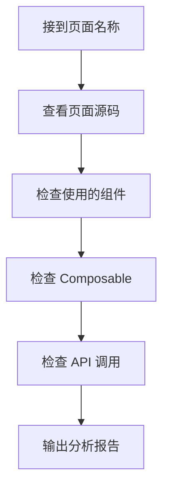

# 后台管理测试与优化规范

> **版本**: V1.0 | **更新时间**: 2026-02-04
> **适用对象**: AI 测试助手、开发者

---

## 📋 文档目的

本文档规定 AI 在测试和优化后台管理系统时：
1. **能做什么** - 允许的优化范围
2. **不能做什么** - 禁止修改的核心逻辑
3. **如何优化** - 标准化的优化流程
4. **长期目标** - 向全局组件化方向靠拢的路线图

---

## 🔴 核心红线 (绝对禁止)

### 业务逻辑禁区

| 禁止项 | 说明 |
|--------|------|
| 页面操作流程 | 不得改变任何页面的操作逻辑和业务流程 |
| API 返回格式 | 不得改变 `{ success, data, error }` 格式 |
| 权限验证流程 | 不得修改 `middleware/mgmt-auth.ts` 核心逻辑 |
| 数据库核心逻辑 | 参见 `CORE_FREEZE_RULES.md` |
| 菜单结构 | 不得擅自增删菜单项 |

### 代码禁止项

```
❌ 绕过 useAdminDialog/useAdminList 自己写弹窗/列表逻辑
❌ 在 admin 中使用 anon key 客户端
❌ 改变任何按钮的最终业务效果
❌ 修改表单字段的验证规则（除非明确要求）
❌ 删除现有功能
❌ 修改 admin-menu.ts 菜单配置
```

---

## ✅ 允许的优化范围

### 1. 性能优化

| 允许项 | 示例 |
|--------|------|
| 请求优化 | 合并重复请求、添加缓存 |
| 渲染优化 | 使用虚拟滚动、懒加载 |
| 代码分割 | 组件按需加载 |
| 减少重渲染 | 优化 computed/watch |

### 2. 代码精简

| 允许项 | 示例 |
|--------|------|
| 删除死代码 | 未使用的变量、函数 |
| 提取共用逻辑 | 相似代码抽成函数/Composable |
| 简化条件判断 | 使用更简洁的表达式 |
| 类型优化 | 添加/完善 TypeScript 类型 |

### 3. 组件标准化

| 允许项 | 示例 |
|--------|------|
| 使用全局组件替换 | 用 `AdminDataTable` 替换自定义表格 |
| 使用 Composable | 用 `useAdminDialog` 替换内联弹窗逻辑 |
| 样式统一 | 使用 CSS 变量替换硬编码颜色 |
| 格式化统一 | 使用 `useBizFormat` 替换内联格式化 |

### 4. 可读性优化

| 允许项 | 示例 |
|--------|------|
| 变量重命名 | 更清晰的命名 |
| 添加注释 | 关键逻辑添加说明 |
| 代码分组 | 相关代码放在一起 |
| 拆分长函数 | 单一职责原则 |

---

## 📊 页面测试流程

### 测试检查清单

对每个页面执行以下检查：

```markdown
## 页面: [页面名称]
路径: `pages/admin/xxx/index.vue`

### 1. 功能验证
- [ ] 列表正常加载
- [ ] 分页正常工作
- [ ] 筛选/搜索正常
- [ ] 新增功能正常
- [ ] 编辑功能正常
- [ ] 删除功能正常（含确认弹窗）
- [ ] 批量操作正常

### 2. 组件使用检查
- [ ] 使用 AdminDataTable (✅/❌ 如否需替换)
- [ ] 使用 AdminDataDialog (✅/❌)
- [ ] 使用 AdminActionCard (✅/❌)
- [ ] 使用 useAdminDialog Composable (✅/❌)
- [ ] 使用 useAdminList Composable (✅/❌)
- [ ] 使用 useBizFormat 格式化 (✅/❌)
- [ ] 使用 useBizConfig 状态配置 (✅/❌)

### 3. 代码质量检查
- [ ] 无 console.log 调试代码
- [ ] 无硬编码状态文案
- [ ] 无重复代码
- [ ] TypeScript 类型完整

### 4. 性能检查
- [ ] 无多余请求
- [ ] 无不必要的重渲染
- [ ] 大列表有分页/虚拟滚动

### 5. 优化建议
[列出发现的可优化项]
```

---

## 🔧 优化执行流程

### Phase 1: 分析 (不做任何改动)



### Phase 2: 规划 (用户确认后执行)

```markdown
## 优化计划: [页面名称]

### 可优化项
1. [优化项1] - [预期效果]
2. [优化项2] - [预期效果]

### 风险评估
- 低风险: [改动项]
- 中风险: [改动项] - 需谨慎测试

### 不做的事项 (保持不变)
- [列出明确不会改动的内容]

### 依赖
- 需要先更新: [如有依赖]
```

### Phase 3: 执行 (逐步改动)

1. **小步快跑**: 每次只改一个点
2. **立即验证**: 改完一个点就验证功能
3. **记录变更**: 详细记录每个改动

### Phase 4: 验证

- 功能是否正常
- 是否达到优化目标
- 是否引入新问题

---

## 🎯 组件标准化路线图

### 长期目标

```
现状: 各页面有自己的实现方式
     ↓
目标: 改一个组件，全局生效
```

### 阶段性任务

#### Stage 1: 统一基础组件 (当前)

| 组件 | 标准 | 检查项 |
|------|------|--------|
| 表格 | `AdminDataTable` | 所有列表页使用 |
| 弹窗 | `AdminDataDialog` | 所有新增/编辑弹窗使用 |
| 操作栏 | `AdminActionCard` | 所有列表页顶部使用 |
| 页面头 | `PageTipHeader` | 所有页面使用 |

#### Stage 2: 统一 Composable

| Composable | 覆盖范围 | 目标 |
|------------|----------|------|
| `useAdminDialog` | 所有弹窗 | 统一弹窗状态管理 |
| `useAdminList` | 所有列表 | 统一列表/分页/筛选 |
| `useBizFormat` | 所有格式化 | 统一金额/日期显示 |
| `useBizConfig` | 所有状态 | 统一状态标签/颜色 |

#### Stage 3: 统一样式系统

| 项目 | 目标 |
|------|------|
| 颜色 | 使用 CSS 变量 `--admin-primary` 等 |
| 间距 | 使用统一间距变量 |
| 字体 | 使用统一字体大小变量 |

#### Stage 4: 原子化按钮 (未来)

```vue
<!-- 目标: 改一处，全局生效 -->
<AdminButton type="primary" action="create" />
<AdminButton type="danger" action="delete" />
```

---

## 📝 标准组件使用规范

### 表格页面标准结构

```vue
<template>
  <div class="page-container">
    <!-- 1. 页面头 -->
    <PageTipHeader title="XX管理" />
    
    <!-- 2. 操作栏 -->
    <AdminActionCard>
      <template #default>
        <!-- 筛选项 -->
      </template>
      <template #actions>
        <el-button @click="loadList">刷新</el-button>
        <el-button type="primary" @click="dialog.openAdd()">新增</el-button>
      </template>
    </AdminActionCard>
    
    <!-- 3. 数据表格 -->
    <AdminDataTable 
      :data="list" 
      :loading="loading" 
      :total="total"
      v-model:current-page="currentPage"
      v-model:page-size="pageSize"
      @page-change="loadList"
    >
      <!-- 列定义 -->
    </AdminDataTable>
    
    <!-- 4. 弹窗 -->
    <AdminDataDialog 
      v-model="dialog.visible.value" 
      :title="dialog.isEdit.value ? '编辑' : '新增'"
      :loading="dialog.loading.value"
      @confirm="dialog.submit"
    >
      <!-- 表单 -->
    </AdminDataDialog>
  </div>
</template>

<script setup lang="ts">
definePageMeta({ layout: 'mgmt', middleware: ['mgmt-auth'] })

// ✅ 使用标准 Composable
const { list, loading, total, currentPage, pageSize, loadList } = useAdminList({...})
const dialog = useAdminDialog({...})

// ✅ 使用标准格式化
const { formatPrice, formatDate } = useBizFormat()
const { getStatusLabel, getStatusType } = useBizConfig()
</script>
```

---

## 🔍 优化前检查项

执行任何优化前，必须确认：

```markdown
## 优化前检查

### 我要优化的是:
[ ] 性能相关
[ ] 代码精简
[ ] 组件标准化
[ ] 可读性

### 确认不会改变:
[ ] 页面的操作流程
[ ] 按钮的最终效果
[ ] API 的调用方式和返回格式
[ ] 用户看到的界面布局

### 我会使用的标准组件/工具:
[ ] AdminDataTable
[ ] AdminDataDialog
[ ] useAdminDialog
[ ] useAdminList
[ ] useBizFormat
[ ] useBizConfig
```

---

## 📋 优化记录模板

每次优化后，记录：

```markdown
## 优化记录: [页面名称]
日期: YYYY-MM-DD

### 优化项
1. [具体改动] - [效果]

### 代码变更
- 文件: `xxx.vue`
- 改动类型: [替换组件/提取逻辑/删除冗余]
- 改动行数: +XX / -XX

### 测试验证
- [ ] 列表加载正常
- [ ] 新增功能正常
- [ ] 编辑功能正常
- [ ] 删除功能正常

### 遗留问题
[如有]
```

---

## 📚 相关文档

| 文档 | 用途 |
|------|------|
| [ADMIN_ENGINEERING_STANDARD.md](./ADMIN_ENGINEERING_STANDARD.md) | 工程开发规范 |
| [ADMIN_DEVELOPMENT_GUIDE.md](../guides/ADMIN_DEVELOPMENT_GUIDE.md) | 开发指南 |
| [CORE_FREEZE_RULES.md](../business_rules/CORE_FREEZE_RULES.md) | 核心冻结规则 |
| [AI_MAINTENANCE_GUIDE.md](../backend/AI_MAINTENANCE_GUIDE.md) | AI 后端维护指南 |
