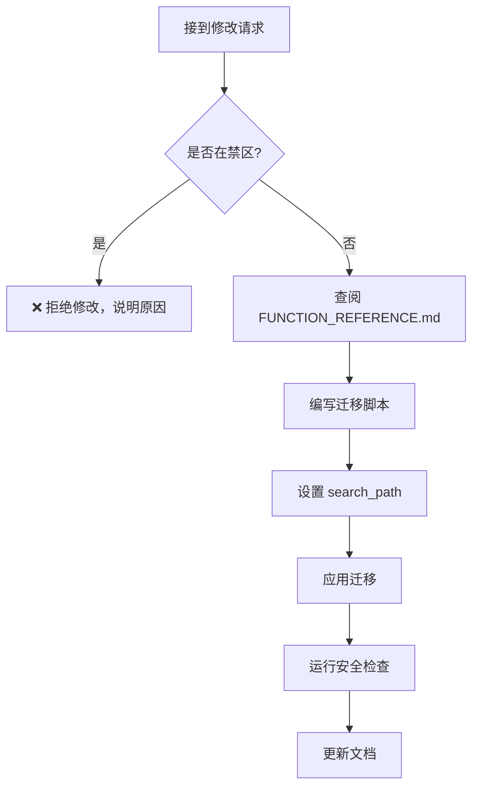
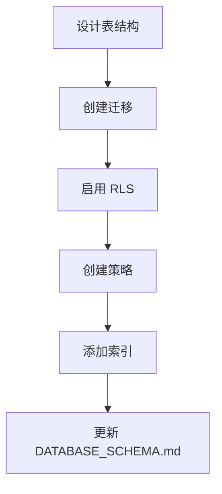
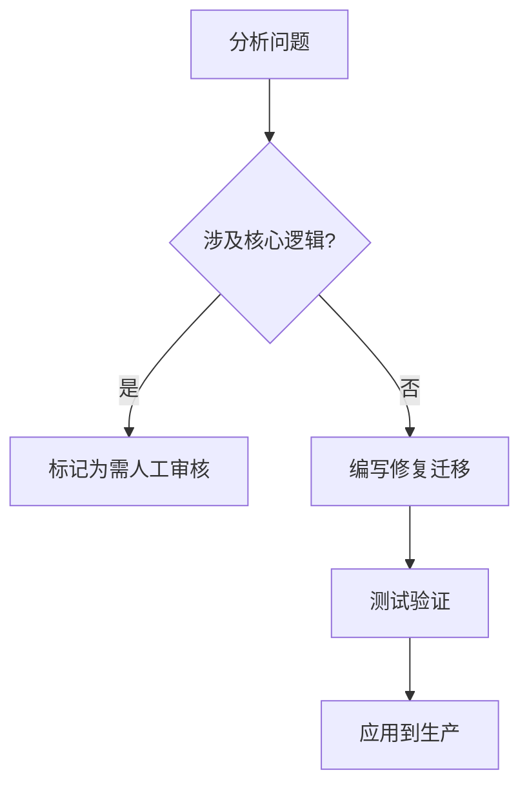

# AI 维护指南

> **版本**: V1.0 | **更新时间**: 2026-02-04

本文档为 AI 助手提供后端维护的规范和工作流程。

---

## 🚨 核心禁区 (绝对禁止修改)

### 禁止修改的业务逻辑

| 模块 | 说明 |
|------|------|
| 商品类型定义 | `virtual`, `shared`, `one_time` 的处理逻辑 |
| 车位分配 | `allocate_slot`, `release_slot` 函数 |
| 映射表关联 | `product_sku_map`, `cdk_sku_map` 的使用方式 |
| slot_index 分配 | 车位索引的分配算法 |

### 禁止的操作

```
❌ 绕过 product_sku_map 直接关联商品和SKU
❌ 绕过 cdk_sku_map 直接关联CDK和SKU
❌ 修改 slot_occupancies 的 slot_index 逻辑
❌ 删除或重命名核心表
❌ 修改 products.type 的枚举值
```

---

## ✅ 允许的操作

```
✅ 添加新表 (需启用 RLS)
✅ 添加新列 (非核心表)
✅ 创建新函数 (需设置 search_path)
✅ 添加索引
✅ 修改 RLS 策略 (需遵循规范)
✅ 修复 bug 类函数
```

---

## 📋 工作流程

### 1. 修改数据库函数



**迁移脚本模板**:
```sql
-- Migration: {description}
-- Date: YYYY-MM-DD

CREATE OR REPLACE FUNCTION public.{function_name}({args})
RETURNS {return_type}
LANGUAGE plpgsql
SECURITY DEFINER
SET search_path TO 'public', 'pg_temp'
AS $$
BEGIN
  -- 函数逻辑
END;
$$;
```

### 2. 添加新表



**必须步骤**:
```sql
-- 1. 创建表
CREATE TABLE public.{table_name} (
  id uuid PRIMARY KEY DEFAULT gen_random_uuid(),
  -- 其他列
  created_at timestamptz DEFAULT now()
);

-- 2. 启用 RLS (必须!)
ALTER TABLE {table_name} ENABLE ROW LEVEL SECURITY;

-- 3. 创建策略
CREATE POLICY "{table}_public_read" ON {table_name}
  FOR SELECT USING (true);

CREATE POLICY "{table}_admin_manage" ON {table_name}
  FOR ALL USING (is_admin());
```

### 3. 修复 Bug



---

## 🔍 安全检查清单

每次修改后执行:

```sql
-- 1. 检查函数 search_path
SELECT proname, proconfig
FROM pg_proc p
JOIN pg_namespace n ON n.oid = p.pronamespace
WHERE n.nspname = 'public' AND proconfig IS NULL;
-- 结果应为空

-- 2. 检查 RLS 启用状态
SELECT tablename, rowsecurity
FROM pg_tables
WHERE schemaname = 'public' AND NOT rowsecurity;
-- 只应有 banners, images, image_categories, product_categories

-- 3. 使用 Supabase Advisor
-- mcp_supabase-mcp-server_get_advisors --type security
```

---

## 📚 必读文档

修改前必须阅读:

| 文档 | 路径 | 内容 |
|------|------|------|
| 核心冻结规则 | `docs/business_rules/CORE_FREEZE_RULES.md` | 禁止修改的核心逻辑 |
| 数据库 Schema | `docs/backend/DATABASE_SCHEMA.md` | 表结构定义 |
| 函数参考 | `docs/backend/FUNCTION_REFERENCE.md` | 函数签名和用法 |
| 状态枚举 | `docs/backend/ENUM_STATUS_VALUES.md` | 状态值定义 |
| RLS 策略 | `docs/backend/RLS_POLICIES.md` | 安全策略 |

---

## 🔧 常用 MCP 命令

### 查询数据库

```
mcp_supabase-mcp-server_execute_sql
  project_id: vjvmzcodbeijnembjiig
  query: SELECT ...
```

### 应用迁移

```
mcp_supabase-mcp-server_apply_migration
  project_id: vjvmzcodbeijnembjiig
  name: migration_name
  query: CREATE ...
```

### 安全检查

```
mcp_supabase-mcp-server_get_advisors
  project_id: vjvmzcodbeijnembjiig
  type: security
```

### 性能检查

```
mcp_supabase-mcp-server_get_advisors
  project_id: vjvmzcodbeijnembjiig
  type: performance
```

---

## 📝 文档更新规范

修改数据库后，必须更新相关文档:

| 修改类型 | 需更新的文档 |
|----------|-------------|
| 新增表 | DATABASE_SCHEMA.md |
| 新增函数 | FUNCTION_REFERENCE.md |
| 修改 RLS | RLS_POLICIES.md |
| 新增状态值 | ENUM_STATUS_VALUES.md |

---

## ⚠️ 错误处理

### 遇到禁区修改请求

回复模板:
```
抱歉，该修改涉及核心业务逻辑，属于禁止修改范围。

根据 CORE_FREEZE_RULES.md，以下逻辑不可修改:
- [具体规则]

建议方案:
- [替代方案]

如确需修改，请联系项目负责人进行人工审核。
```

### 迁移失败

1. 检查函数签名是否正确
2. 检查表/列是否存在
3. 使用 `mcp_supabase-mcp-server_execute_sql` 查询验证
4. 分步执行迁移

---

## 🎯 测试指南

### 功能测试要点

| 模块 | 测试项 |
|------|--------|
| 订单创建 | 预订单→正式订单流程 |
| 支付 | 余额扣减、优惠券使用 |
| 车位分配 | shared 类型商品分配/释放 |
| CDK消耗 | virtual/one_time 类型库存变化 |
| 续费 | 订单延期逻辑 |
| 退款 | 余额返还、车位释放 |

### 边界条件

- 库存为 0 时的购买请求
- 优惠券过期/不满足条件
- 并发车位分配
- 订单过期自动处理
