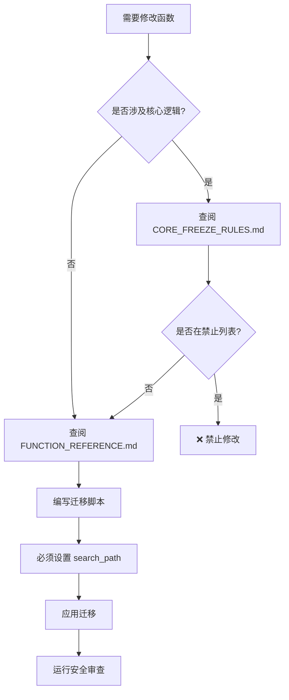

# 后端文档索引

> **版本**: V1.0 Production | **更新时间**: 2026-02-04 | **数据库**: PostgreSQL 17.6.1

本目录包含 Fantula 项目后端的完整技术文档，基于当前生产环境状态生成。

---

## 📚 文档列表

| 文档 | 说明 | 适用对象 |
|------|------|----------|
| [DATABASE_SCHEMA.md](./DATABASE_SCHEMA.md) | 数据库表结构完整定义 | 后端开发/AI测试 |
| [FUNCTION_REFERENCE.md](./FUNCTION_REFERENCE.md) | 数据库函数API参考 | 前后端开发 |
| [EDGE_FUNCTIONS.md](./EDGE_FUNCTIONS.md) | Edge Functions 开发与 R2 集成 | 后端开发 |
| [RLS_POLICIES.md](./RLS_POLICIES.md) | 行级安全策略说明 | 安全审查/维护 |
| [AI_MAINTENANCE_GUIDE.md](./AI_MAINTENANCE_GUIDE.md) | AI维护工作流程与规则 | AI助手 |
| [ENUM_STATUS_VALUES.md](./ENUM_STATUS_VALUES.md) | 状态值和枚举定义 | 前后端开发 |

---

## 🔒 核心规则

### 禁止修改的核心逻辑 (参见 `CORE_FREEZE_RULES.md`)

1. **商品类型定义**
   - `virtual` (虚拟充值) → CDK.stock 控制库存
   - `shared` (账号合租) → slot_occupancies 车位模型
   - `one_time` (一次性CDK) → CDK.status 状态控制

2. **多对多关联表** (必须通过映射表)
   - 商品↔SKU: `product_sku_map`
   - CDK↔SKU: `cdk_sku_map`

3. **禁止操作**
   - ❌ 禁止修改 slot_index 分配逻辑
   - ❌ 禁止绕过映射表直接关联
   - ❌ 涉及核心表结构修改必须先确认

---

## 🛠 维护工作流程

### 修改数据库函数

### 添加新表

1. 查阅 `DATABASE_SCHEMA.md` 了解现有结构
2. 必须启用 RLS (`ALTER TABLE ... ENABLE ROW LEVEL SECURITY`)
3. 创建适当的 RLS 策略
4. 更新文档

---

## 📂 相关文档

- [业务规则](../business_rules/) - 核心业务逻辑说明
- [架构规范](../architecture/) - 前后端架构标准
- [开发指南](../guides/) - 开发流程指南
