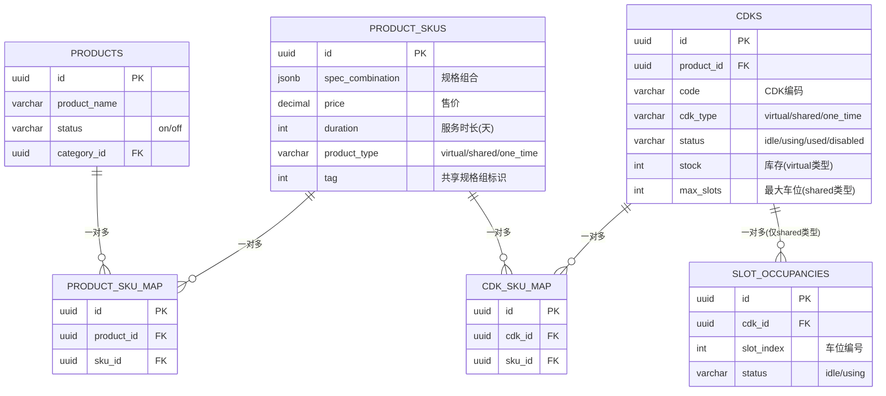

# Fantula 核心逻辑文档

> **版本**: 1.0  
> **更新日期**: 2026-01-14  
> **文档性质**: 项目核心架构定义，任何开发工作必须遵循本文档

---

## 一、核心实体关系图



---

## 二、三种商品类型 (product_type)

> **核心规则**: 商品类型由 SKU 决定，同一商品的不同 SKU 可以是不同类型

| 类型 | 代码值 | 描述 | 库存机制 | 典型场景 |
|------|--------|------|----------|----------|
| **虚拟充值** | `virtual` | 无限复用的虚拟服务 | CDK 的 `stock` 字段控制库存数量 | 游戏点卡、话费充值 |
| **账号合租** | `shared` | 多人共享的账号资源 | 通过 `slot_occupancies` 表管理"车位" | Netflix合租、会员共享 |
| **一次性CDK** | `one_time` | 一次性激活码 | CDK 状态 `idle→used` | 激活码、兑换码 |

### 2.1 虚拟充值 (virtual)

```
┌─────────────────────────────────────────────────────────────┐
│  购买流程:                                                   │
│  1. 查找关联SKU的CDK (stock >= 购买数量)                      │
│  2. 扣减 CDK.stock                                           │
│  3. 支付成功后可立即使用（充值类无发货概念）                    │
└─────────────────────────────────────────────────────────────┘
```

### 2.2 账号合租 (shared)

```
┌─────────────────────────────────────────────────────────────┐
│  购买流程:                                                   │
│  1. 查找关联SKU的CDK，找到空闲车位 (slot_occupancies.status='idle')
│  2. 锁定车位 (status → 'using')                              │
│  3. 支付成功后分配账号信息，车位绑定订单                       │
│                                                              │
│  车位逻辑:                                                   │
│  - 每个 shared CDK 有 max_slots 个车位                       │
│  - slot_index 一旦分配，永久绑定，过期只改状态不删除           │
│  - 续费：原车位原订单叠加时间                                 │
└─────────────────────────────────────────────────────────────┘
```

### 2.3 一次性CDK (one_time)

```
┌─────────────────────────────────────────────────────────────┐
│  购买流程:                                                   │
│  1. 查找关联SKU的CDK (status='idle')                         │
│  2. 锁定CDK (status → 'using')                               │
│  3. 支付成功后CDK状态保持 'using'，用户获取激活码             │
│                                                              │
│  不可续费，一次性消耗                                         │
└─────────────────────────────────────────────────────────────┘
```

---

## 三、多对多关联机制

### 3.1 商品 ↔ SKU 关系 (`product_sku_map`)

> **核心规则**: 一个SKU可以被多个商品共享，一个商品可以有多个SKU

```
┌─────────────────────────────────────────────────────────────┐
│  场景示例:                                                   │
│                                                              │
│  商品A: Netflix 港区合租                                      │
│    └── SKU-1: 30天/￥29 (tag=1, product_type=shared)         │
│    └── SKU-2: 90天/￥79 (tag=1, product_type=shared)         │
│                                                              │
│  商品B: Netflix 日区合租                                      │
│    └── SKU-1: 30天/￥29 (同一个SKU复用!)                      │
│    └── SKU-3: 30天/￥35 (日区专属)                            │
│                                                              │
│  通过 product_sku_map 实现:                                  │
│  | product_id | sku_id |                                     │
│  | 商品A      | SKU-1  |                                     │
│  | 商品A      | SKU-2  |                                     │
│  | 商品B      | SKU-1  | ← 同一SKU关联多个商品                 │
│  | 商品B      | SKU-3  |                                     │
└─────────────────────────────────────────────────────────────┘
```

**共享SKU组 (tag机制)**:
- `product_skus.tag` 字段用于标识可共享的SKU组
- 相同 `tag` 的SKU可以被拖拽到不同商品
- `shared_sku_groups` 表存储 tag 的名称

### 3.2 CDK ↔ SKU 关系 (`cdk_sku_map`)

> **核心规则**: 一个CDK可以服务多个SKU，一个SKU可以从多个CDK获取库存

```
┌─────────────────────────────────────────────────────────────┐
│  场景示例:                                                   │
│                                                              │
│  CDK-001: Netflix 美区账号 (max_slots=4)                     │
│    └── 可服务 SKU-A: 港区30天                                 │
│    └── 可服务 SKU-B: 日区30天                                 │
│    └── 可服务 SKU-C: 韩区30天                                 │
│                                                              │
│  CDK-002: Netflix 欧区账号 (max_slots=4)                     │
│    └── 可服务 SKU-A: 港区30天 (同一SKU连接多个CDK!)           │
│    └── 可服务 SKU-D: 英区30天                                 │
│                                                              │
│  通过 cdk_sku_map 实现:                                      │
│  | cdk_id   | sku_id |                                       │
│  | CDK-001  | SKU-A  |                                       │
│  | CDK-001  | SKU-B  |                                       │
│  | CDK-001  | SKU-C  |                                       │
│  | CDK-002  | SKU-A  | ← 同一SKU关联多个CDK                   │
│  | CDK-002  | SKU-D  |                                       │
└─────────────────────────────────────────────────────────────┘
```

**库存计算逻辑**:
```sql
-- 获取SKU的可用库存（示例）
SELECT 
  CASE 
    WHEN cdk_type = 'shared' THEN 
      -- 合租类型：统计空闲车位数
      COUNT(DISTINCT slot_occupancies.id) WHERE status='idle'
    ELSE 
      -- 虚拟/一次性：统计CDK库存总和
      SUM(cdks.stock) WHERE status='idle'
  END
FROM cdks
JOIN cdk_sku_map ON cdk_id = cdks.id
WHERE sku_id = ?
```

---

## 四、核心数据流

### 4.1 下单流程 (create_pre_order)

```
用户选择SKU并下单
       │
       ▼
┌──────────────────┐
│ 1. 验证用户登录   │
│ 2. 检查待支付订单数│ (限制3个)
└────────┬─────────┘
         │
         ▼
┌──────────────────────────────────────┐
│ 3. 通过 product_sku_map 获取商品信息  │
└────────┬─────────────────────────────┘
         │
         ▼
┌──────────────────────────────────────┐
│ 4. 根据 product_type 锁定资源        │
│    - virtual: 扣减 CDK.stock         │
│    - shared: 锁定 slot_occupancies   │
│    - one_time: CDK.status → using    │
└────────┬─────────────────────────────┘
         │
         ▼
┌──────────────────┐
│ 5. 创建预订单     │ (15分钟有效期)
│ 6. 返回支付页面   │
└──────────────────┘
```

### 4.2 资源回滚机制

```
预订单过期 / 用户取消
       │
       ▼
┌──────────────────────────────────────┐
│ release_preorder_resources()          │
│                                       │
│ - virtual: CDK.stock += quantity      │
│ - shared: slot.status → idle          │
│ - one_time: CDK.status → idle         │
└───────────────────────────────────────┘
```

---

## 五、开发红线 (禁止事项)

| ❌ 禁止操作 | 原因 |
|------------|------|
| 修改三种商品类型定义 | 架构基石，改动影响全局 |
| 物理删除订单记录 | 财务追溯必须保留 |
| 修改 slot_index 分配逻辑 | 用户体验依赖固定车位 |
| 绕过 `product_sku_map` 直接关联 | 破坏多对多架构 |
| 绕过 `cdk_sku_map` 直接关联 | 破坏资源分配逻辑 |

---

## 六、核心数据库表速查

### 主表
| 表名 | 描述 |
|------|------|
| `products` | 商品表（展示层） |
| `product_skus` | SKU表（价格/规格/类型） |
| `cdks` | CDK资源表（库存实体） |
| `orders` | 订单表（支付记录） |
| `pre_orders` | 预订单表（锁定中） |

### 关联表
| 表名 | 描述 |
|------|------|
| `product_sku_map` | 商品↔SKU 多对多映射 |
| `cdk_sku_map` | CDK↔SKU 多对多映射 |
| `slot_occupancies` | 合租车位分配记录 |

### 辅助表
| 表名 | 描述 |
|------|------|
| `shared_sku_groups` | 共享SKU组定义 |
| `product_categories` | 商品分类 |

---

## 七、扩展功能预留

本核心架构支持以下未来扩展：
- ✅ SKU复用跨多商品
- ✅ CDK池化管理
- ✅ 灵活的规格组合
- ✅ 优惠券系统 (已实现)
- ⏳ 库存预警
- ⏳ 自动补货
- ⏳ 多租户支持

---

> **文档维护**: 如需修改本文档，请先创建 Issue 讨论，经团队确认后方可更新。
